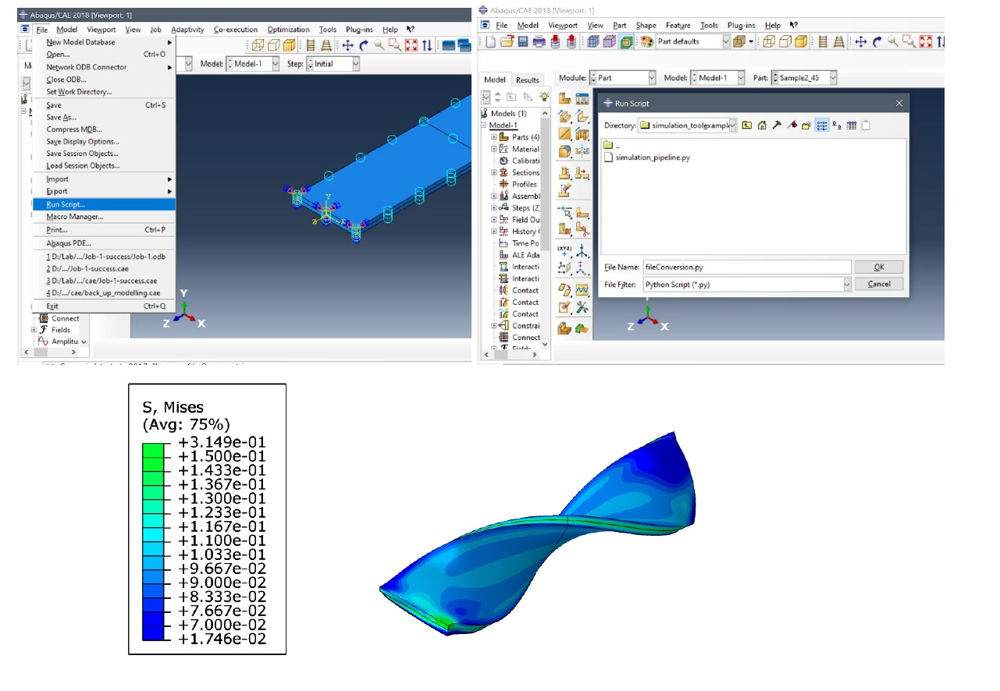

# MorphingCircuit-simulation-pipeline
This is the code for MorphingCircuit users to implement the simulation pipeline by following the instruction. 

Prerequisite installation: Abaqus, Rhino, Compiled Python environment. 

We present our Python source code of the simulation pipeline, which can be used to automatically conduct the simulation with some specified input geometry files and settings.

In the folder, there are seven files: the file “simulation_pipeline.py” is the to-be-executed Python source code; the two “.txt” formatted files are the material data files, in which the PLA’s hyperelasticity and viscoelasticity are defined separately; we also provide four “.sat” formatted files as an example, which are the CAD geometry files derived from the Rhino software.

As described in Section 5.2, user needs to follow a specified workflow in order to utilize this simulation tool. In this pipeline, users only need to put the pre-designed geometry files (must in .sat format) in the same folder with the Python file and the material definition files , and then submit the code to Abaqus’s FEA solve for simulation. Since our code can currently only be compatible with Abaqus, the pre-installed Abaqus software is, therefore, a prerequisite for now.

To submit the code to Abaqus, user needs to firstly open the Abaqus software, then choose: File -> Run script , and then choose the Python code file and click OK . If everything is operated correctly, Abaqus can then automatically build a model, conduct the FEA simulation, and yield the result. The file directory of the final result will be presented once the task is done.

